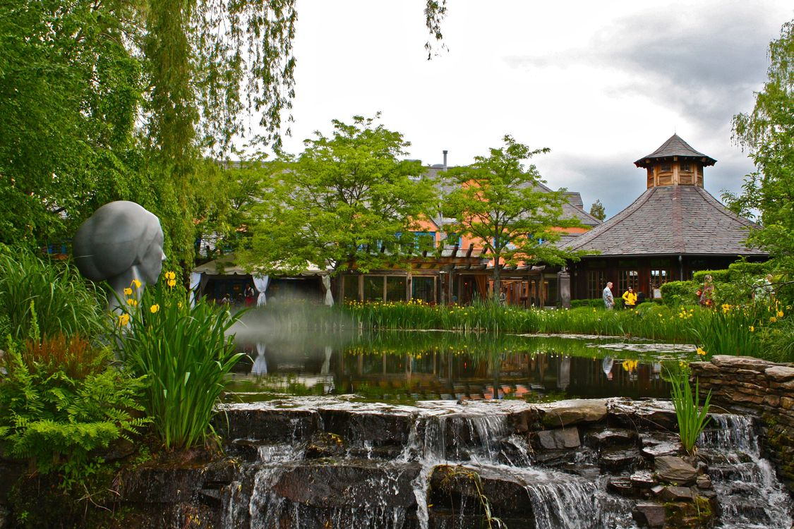

# odin-landing-page

## Brief introduction
This project will help me further solidify my HTML along with my CSS that I've learned throughout the CSS foundations part of the TOP course.
I will be recreating to the best of my abilities a landing page as close as possible to the image provided 

## Languages learned
HTML\
CSS

## Credits to images
 \
Sushil Laishram\
https://www.pexels.com/@slaishram/  
https://www.pexels.com/photo/timelapse-photography-of-waterfalls-271160/

 
 

 \
Luke Thornton\
https://unsplash.com/@lukethorntonofficial  
https://unsplash.com/photos/a-close-up-of-a-cat-with-green-eyes-l6wjeA3gnnM

 
 

 \
Takashi Miyazaki\
https://unsplash.com/@miyatankun  
https://unsplash.com/photos/illuminated-city-skyline-at-twilight-with-a-prominent-purple-tower-SiNOkXcPz6U

 
 

 \
Klara Kulikova\
https://unsplash.com/@kkalerry  
https://unsplash.com/photos/the-sun-is-shining-through-the-palm-trees-kEjJ-2fmOBw